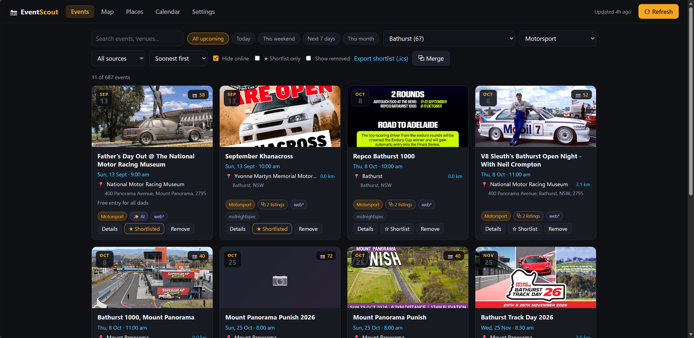
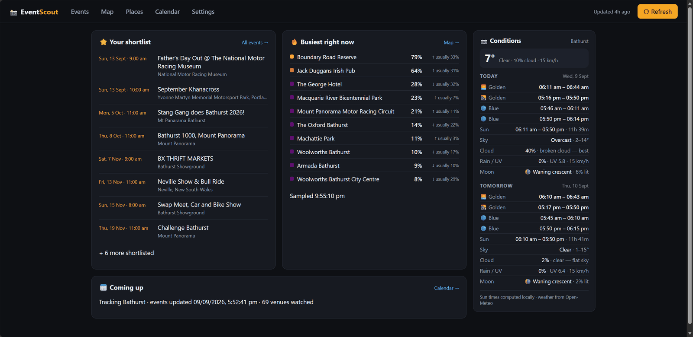
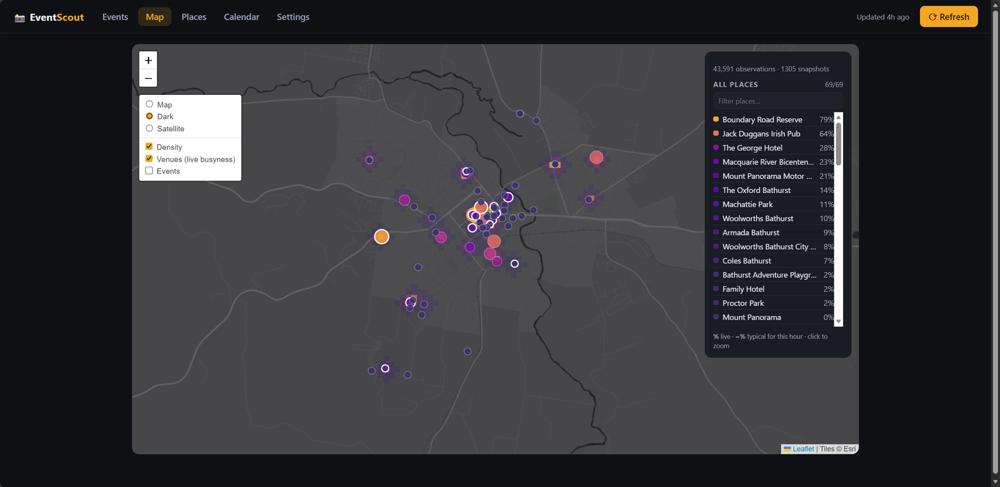
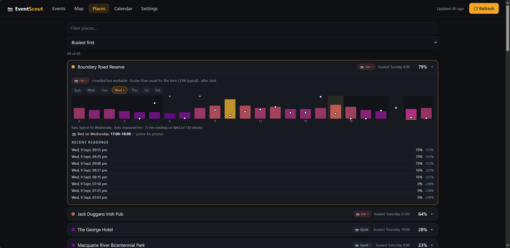
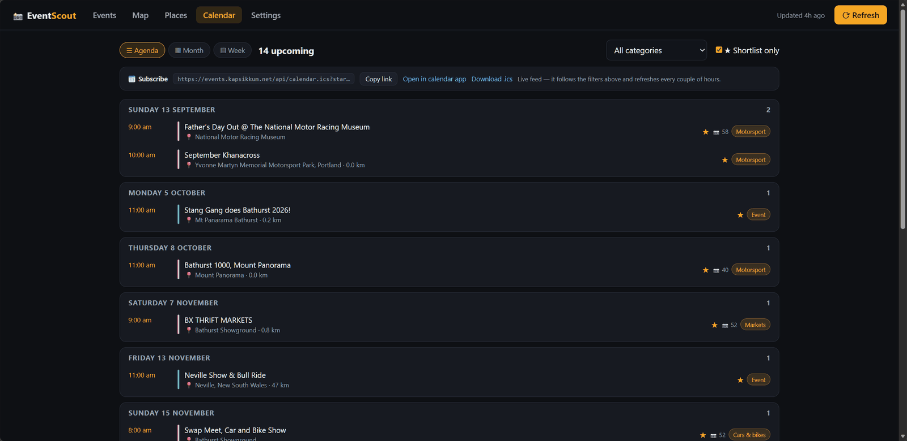
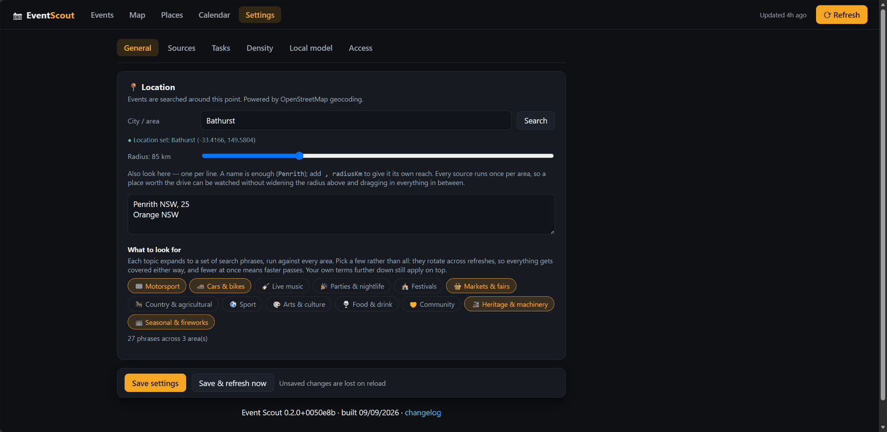

# Event Scout

Aggregates upcoming local events from several sources into one list, scored and
filtered for photography scouting. Everything runs on your machine; API keys and
the event cache live in a local SQLite file.



## A look around

<table>
<tr>
<td width="50%"><br>
<b>Home</b> — your shortlist, which venues are busiest right now, and the
light: golden and blue hours, cloud, moon.</td>
<td width="50%"><br>
<b>Map</b> — events and venue busyness over dark, street or satellite tiles.</td>
</tr>
<tr>
<td><br>
<b>Places</b> — measured busyness per venue against its typical week, and the
hour worth shooting.</td>
<td><br>
<b>Calendar</b> — agenda, month or week, with a live <code>.ics</code> feed to
subscribe to.</td>
</tr>
<tr>
<td><br>
<b>Settings</b> — where to look, what to look for, and which of the optional
passes to run.</td>
<td></td>
</tr>
</table>

## Requirements

- **Docker**, or **Node 24+** — the database layer uses `node:sqlite` and older
  Node will not run it.
- Nothing else. Every source is optional; the app works with any subset.

## Run it

### Docker

```bash
docker compose pull
docker compose up -d
```

Open <http://localhost:3001>.

Put settings in a `.env` beside `docker-compose.yml`:

```
TZ=Australia/Sydney
AUTH_PASSWORD=
OLLAMA_URL=http://host.docker.internal:11434
```

Update with `docker compose pull && docker compose up -d`. The database and
browser profile are named volumes and survive it. To run local changes:
`docker compose up --build`.

### From source

```bash
npm install
npm run dev
```

API on :3001, UI on <http://localhost:5173>. Or one production process:

```bash
npm run build
npm start
```

UI and API together on <http://localhost:3001>.

## First run

With no location set you land on a walk-through at `/setup`: location, sources,
access, local model, flyer reading — one step at a time. Only the first is
required; the rest carry a Skip. **Finish & search now** saves and starts the
first refresh. There is a link out to the full settings page if you would rather
not be walked through it.

## Event sources

| Source | Needs | Notes |
|---|---|---|
| Ticketmaster | Free API key from [developer.ticketmaster.com](https://developer.ticketmaster.com/) | Concerts, sport, theatre. 5,000 calls/day. |
| SeatGeek | Free client ID from [seatgeek.com/account/develop](https://seatgeek.com/account/develop) | Complements Ticketmaster. |
| Eventbrite | Private token + organizer IDs | Public search was removed from their API, so you follow specific organizers — the number in `eventbrite.com/o/name-1234567890`. |
| Facebook | Nothing, or a logged-in cookie | Scraper. Much better with a cookie: log in → F12 → Application → Cookies → paste `c_user=…; xs=…` into Settings. |
| Web search | Nothing | Queries DuckDuckGo/Mojeek/Bing, follows results, extracts `schema.org/Event` JSON-LD. Structured data only. |
| iCal feeds | Feed URLs | Council, tourism, venue and university `.ics` calendars. |
| MIDNIGHT_SPEC | Nothing | Australian car meets, track days, Cars & Coffee. Reads JSON-LD from six state pages. |

**Facebook:** scraping facebook.com violates Meta's terms, breaks when their
markup changes, and could get the account restricted — use a throwaway. A failed
Facebook fetch never affects the other sources.

**MIDNIGHT_SPEC** is a national feed whose listings carry no coordinates, so
events are kept only where the town matches one of your areas. Ticking states in
Settings saves a request each; it does not change what is kept.

## Tasks

Background jobs, on the **Tasks** page with schedule, last run, next due, last
result and a Run button.

| Task | Runs | Does |
|---|---|---|
| `events` | every 6 h, ticked hourly | Fetch every enabled source across every area, then tidy, place and de-duplicate. |
| `archive` | every 10 min | Move finished events to the archive; purge archived rows over 730 days old. |
| `density` | your interval (default 60 min), ticked every 5 min | One page load per venue, recording how busy each is. |
| `enrich` | your interval (default 60 min) | Read listings with a local model. Off by default. |
| `vision` | your interval (default 60 min) | Read event flyers with a vision model. Off by default. |
| `densityDiscover` | when asked | Rebuild the venue list. Slow, rarely needed. |

At the foot of the tab is a **console**: every task's output in one place, in
order, as it happens. Each task keeps its own log too, but reading them one at a
time cannot show what the machine was doing at a given moment, which is the
question you have when something looks wrong. It is held in memory, so a restart
clears it, and the page polls only for lines it has not already seen.

- A task refuses to start a second copy of itself rather than queueing.
- `density` and `densityDiscover` share one lock — they drive the same browser
  and profile directory. The other shows "waiting on …" rather than failing.
- Ticks are more frequent than the intervals they gate, so changing an interval
  takes effect without a restart.

## Access

No password by default: everything is open, and compose publishes port 3001 on
every interface.

Set one (Settings → Access, or `AUTH_PASSWORD`) and reading stays open while
everything else needs it.

| Open | Needs the password |
|---|---|
| Events, map, places, calendar, tasks, status, version | Saving settings, refreshing, running tasks |
| The `.ics` feed, with its token | Starring, hiding, merging, unmerging |
| | `GET /api/settings` — the credentials themselves are redacted, but it still describes everything this instance watches |

Sessions are a signed cookie (`node:crypto`; the secret is kept in the database
so sign-in survives a restart). Passwords are scrypt-hashed. `AUTH_PASSWORD`
wins when set and cannot then be changed from the UI. Six wrong guesses locks
that address out for 30 seconds.

Calendar clients cannot sign in, so once a password is set the `.ics` feed needs
a token in its URL — copy the subscribe URL from Settings. URLs subscribed
before you set a password keep working until you do.

## Reading listings with a local model

Optional, off by default. Point Settings → Local model at an
[Ollama](https://ollama.com) and it runs as the `enrich` task.

| Job | Does |
|---|---|
| Tidy descriptions | Rewrite a scraped blurb into two or three plain sentences. |
| Categorise | Pick a category for listings the keyword classifier cannot place. |
| Fill in blanks | Read venue, address or price out of the description, **only where the stored field is empty**. |
| Judge photo appeal | Rate how worth shooting an event is, averaged with the keyword score. |

Each toggles separately; the JSON schema is built from the ones you enable, so a
job that is off cannot produce a field.

Verdicts go in separate `llm_*` columns, never over the scraped values — turn
the task off and everything reverts. The category is pinned to an enum of known
categories, scores are clamped, and extraction is ignored for fields the source
already filled.

Anything a model wrote is marked as such: an ✨ AI badge on the card, and a
footnote in the detail view naming the fields and which pass supplied them. The
API says the same thing in the `enriched` object on every event.

An event is read once. A content hash of the text, model and prompt version is
stored, so a run only picks up what is new or changed. Each pass takes
`llmMaxPerRun` events (default 40); expect roughly 15–20 s per event on an 8B
model on CPU. **Forget what it decided** clears every verdict.

Blank `llmUrl` falls back to `OLLAMA_URL`, then `http://localhost:11434`. From a
container the host's Ollama is `http://host.docker.internal:11434`, not
localhost.

## Reading flyers with a vision model

Optional, off by default, and separate from the text pass above — a different
model, its own schedule, its own switch.

The image address comes from the listing, so it is chosen by whoever published
it. Flyers are only fetched over http(s) from addresses outside your network:
anything resolving to a private, loopback or link-local address is refused, and
each redirect is checked again rather than followed blindly.

Most listings arrive with a promotional image, and for those scraped from
organiser posts the practical detail is printed on it rather than written
anywhere a parser can reach. The text pass cannot help: asked to fill blank
venue and price fields from prose it filled none in eighty events, because the
prose genuinely does not say. The flyer does.

It reads `venueName`, `address`, `priceText` and one short `note` — when gates
open, which entrance to use — and **fills only fields the listing left blank**.
The note is shown on the event and nothing is derived from it.

**It is not asked for the date or the start time.** Handed a flyer printing both,
qwen2.5vl answered "SEPTEMBER 9TH 2026" as the time. Dates are what this app
defends hardest, with a validator, a past-grace window and a consensus rule
between sources; a model that confuses the two has no business near them.

| Setting | Meaning |
|---|---|
| `visionEnabled` | Off by default. |
| `visionModel` | Must be a model that can see. `qwen2.5vl:7b` works; `qwen3-vl:8b` answers nothing when given a schema. |
| `visionIntervalMinutes` | Default 60. |
| `visionMaxPerRun` | Flyers per pass, default 20. |

Uses the same Ollama as the text pass. It asks for a 16k context — a flyer is a
few thousand tokens and the 4096 default simply errors. Where a source publishes
a thumbnail it reads that instead of the full image: same reading, a fraction of
the bytes and the time. Roughly 6–25 seconds a flyer.

Only events missing a venue, address or price are considered, so the queue is a
fraction of the library rather than all of it. **Forget what it read** in
Settings clears every reading.

Routes: `GET /api/llm/status` (the `vision` block), `POST /api/vision/reset`.

## Venue density

Off by default. Samples how busy venues are on its own schedule, feeding the
density overlay on Map and the per-venue history on Places. Each pass opens one
page per venue, so it takes minutes.

| Setting | Meaning |
|---|---|
| `densityEnabled` | Off by default. |
| `densityIntervalMinutes` | 15–240, default 60. |
| `densityCities` | Blank means every configured area. |
| `densityMaxVenues` | Cap per area, default 30. 0 means no cap. |
| `densityPlaces` | Venues pinned by name. |
| `densitySearches` | Map search terms. Blank uses the defaults. |
| `densityCellMeters` / `densityKernelMeters` | Grid resolution, default 150 / 300. |

Samples are the largest thing this app stores — roughly two thousand rows a day
while sampling is on. They are kept for a year and then pruned by the `archive`
task, which runs whether or not sampling is enabled. Nothing on screen reaches
back further than a fortnight: the map defaults to 24 hours and the per-venue
history to 14 days.

## Configuration

### Environment

| Variable | Default | Meaning |
|---|---|---|
| `API_PORT` | `3001` | Backend port. |
| `TZ` | `Australia/Sydney` | Decides when an event counts as past. |
| `AUTH_PASSWORD` | unset | Sets a password. Unset means open. |
| `OLLAMA_URL` | `http://localhost:11434` | Default Ollama; the setting overrides it. |
| `BROWSER_CDP_URL` | unset | Attach to an existing Chromium. Set in compose; unset starts one locally. |

`GIT_SHA` and `BUILD_TIME` are build arguments, reported by `/api/version`.

### Settings

Everything else is stored in the database and edited in the UI or through
`PUT /api/settings`: `city`, `lat`, `lng`, `radiusKm`, `eventAreas`,
`eventTopics`, `enabledSources`, `ticketmasterKey`, `seatgeekClientId`,
`eventbriteToken`, `eventbriteOrganizerIds`, `fbCookie`, `fbSearchTerms`,
`fbPages`, `webSearchTerms`, `icalFeeds`, `midnightspecStates`, `tasksDisabled`,
`corsOrigins`,
`llmEnabled`, `llmUrl`, `llmModel`, `llmJobs`, `llmIntervalMinutes`,
`llmMaxPerRun`, `visionEnabled`, `visionModel`, `visionIntervalMinutes`,
`visionMaxPerRun`, and the `density*` keys above.

## API

JSON unless stated. With a password set, every non-`GET` needs either the
session cookie or an API token, as do `GET /api/settings`,
`GET /api/auth/feed-token` and `GET /api/auth/token`.

For scripts, make a token in Settings → Access → API token and send it as a
bearer. It is the password in another form — anything the password permits, it
permits — so treat it like one, and revoke it there when it is done with.

```bash
curl -X POST -H 'Authorization: Bearer <token>' http://localhost:3001/api/refresh
```

Errors are always `{ "error": "..." }` with a 4xx or 5xx status — including a
malformed request body, which Express would otherwise answer with an HTML page.
A bad query parameter is a `400` rather than a silently unfiltered list: a
filter that is ignored gives you a complete answer and no reason to doubt it.
A `5xx` says only that something went wrong; what it was goes to the log.

### Events

| Route | Meaning |
|---|---|
| `GET /api/events` | Upcoming events, merged and de-duplicated. An array. |
| `GET /api/events/:group` | One event by its `group`, upcoming or past. `404` if there is no such group. |
| `POST /api/refresh` | Refresh now. `409` if one is already running. |
| `POST /api/archive` | Archive finished events now. |
| `POST /api/merge` | Body `{ groups: string[] }`, at least two. |
| `POST /api/unmerge/:group` | Split a merged group. |
| `POST /api/groups/:group` | Body `{ starred?: boolean, hidden?: boolean }`. |

#### Filtering the list

`GET /api/events` takes any combination of these. With none of them it returns
every upcoming event, which is what the web app wants and is about a megabyte.

| Parameter | Meaning |
|---|---|
| `archived` | `true` for past events, newest first. Default `false`. `1`/`0` and `yes`/`no` also work. |
| `q` | Free text across the title, description, venue and address. |
| `category` | One or more, comma-separated. Case-insensitive. |
| `locality` | Suburb or town, comma-separated. |
| `place` | The town an event rounds to, comma-separated. |
| `source` | Source name, comma-separated — `MIDNIGHT_SPEC`, `eventbrite`, `ical`… |
| `from`, `to` | Inclusive bounds on the start time. A plain `2026-09-25` covers that whole day; a full timestamp is taken exactly. |
| `starred`, `hidden`, `online` | `true` or `false`. |
| `minScore` | Lowest photo score to include, 0–100. |
| `limit`, `offset` | One page of the matches. `limit` is 1 or more. |

Repeat a value with a comma, not a repeated parameter: `?category=A,B`, not
`?category=A&category=B`. An unknown parameter is a `400` naming the ones it
knows.

`X-Total-Count` carries how many matched before `limit` and `offset` were
applied, so a caller paging through knows when to stop.

```bash
curl 'http://localhost:3001/api/events?place=Bathurst&from=2026-09-25&to=2026-09-27&minScore=60'
```

#### Calling it from another site

A browser will not let a page served from one address read an API on another
unless the API says so. List the origins you want to allow in Settings → Access
→ Other sites, one per line — scheme and host, no path. `*` allows any. Empty,
the default, allows none.

```
https://dash.example.com
http://localhost:5173
```

What a listed origin gets is narrower than the list suggests, and deliberately:

- **Reads only.** Never a `POST`, `PUT` or `DELETE`, whatever is on the list.
  Without a password every write is open to anyone who can reach the port, and
  granting those across origins would let any page you happen to visit rewrite
  your settings.
- **Not `/api/settings` or `/api/auth/feed-token`**, which carry your API keys
  and the calendar secret.
- **No credentials.** The session cookie is `sameSite=lax` and is not sent
  across sites, so a listed origin sees exactly what a signed-out visitor sees.

`X-Total-Count` and `ETag` are exposed, so paging and conditional gets work
cross-origin too.

#### Polling it

Responses carry an `ETag`. Send it back as `If-None-Match` and an unchanged
list answers `304 Not Modified` with no body.

```bash
curl -H 'If-None-Match: W/"101864-XCTHabqighdqzKVFO42Fvry1gEU"' http://localhost:3001/api/events
```

#### What a model wrote

Every event carries an `enriched` object naming the fields you are reading a
model's answer for, so a generated sentence is never mistaken for the
organiser's own. `model` is the text pass, `flyer` the vision one; fields not
listed are as the source published them, and with the enrichment tasks off it
is always `{}`.

```json
{ "description": "model", "category": "model", "note": "flyer" }
```

Scraped values are never overwritten — see [Reading listings with a local
model](#reading-listings-with-a-local-model) for which fields a model may
replace and which it may only fill in when blank.

### Status

| Route | Meaning |
|---|---|
| `GET /api/status` | `{ sources, lastRefresh, refreshing, progress, density }`. |
| `GET /api/version` | `{ version, commit, builtAt, display }`. |
| `GET /api/topics` | The preset event topics. |
| `GET /api/geocode?q=` | Geocode a place name via OpenStreetMap. |
| `GET /api/photo` | Sun, moon and weather for the configured location. `?force=1` skips the cache. |

### Tasks

| Route | Meaning |
|---|---|
| `GET /api/tasks` | `{ tasks, log, seq }` — schedules and state, plus console lines. `?since=<seq>` returns only newer lines. |
| `POST /api/tasks/:name/run` | Run now, ignoring schedule and enabled state. `409` if blocked. |
| `POST /api/tasks/:name/enable` | Body `{ enabled: boolean }`. |

Names: `events`, `archive`, `density`, `enrich`, `vision`, `densityDiscover`.

### Settings and auth

| Route | Meaning |
|---|---|
| `GET /api/settings` | All settings. **Gated.** API keys and the Facebook cookie come back as `""`; `secretsSet` says which are stored. |
| `PUT /api/settings` | Partial update, merged over the current settings. For a credential, `""` or omitted leaves the stored value alone — send `null` to clear it. |
| `GET /api/auth/status` | `{ required, authed, fromEnv }`. |
| `POST /api/auth/login` | Body `{ password }`. Sets the session cookie. |
| `POST /api/auth/logout` | Clears it. |
| `POST /api/auth/password` | Body `{ current, next }`. An empty `next` removes the password. |
| `GET /api/auth/feed-token` | The calendar feed token. **Gated.** |
| `POST /api/auth/feed-token` | Regenerate it, breaking existing subscriptions. |
| `GET /api/auth/token` | The API token, or `""` if there is none. **Gated.** |
| `POST /api/auth/token` | Create one, or replace the existing one. |
| `DELETE /api/auth/token` | Revoke it without making a new one. |

### Density

| Route | Meaning |
|---|---|
| `GET /api/density/status` | Enabled, running, interval, last run, areas, log. |
| `GET /api/density/areas` | Configured areas with venue counts. |
| `GET /api/density/:area` | Density grid as GeoJSON. `?hours=` (default 24), `?all=1`, `?hour=`, `?days=0,6`. |
| `GET /api/density/:area/venues` | Per-venue readings and shoot verdicts. |
| `GET /api/density/:area/history?venue=` | One venue's history. `?days=` default 14. |
| `POST /api/density/refresh` | Sample now. |
| `POST /api/density/discover` | Rebuild the venue list. |

### Local model

| Route | Meaning |
|---|---|
| `GET /api/llm/status` | Reachability, installed models, chosen model, backlog, available jobs. |
| `POST /api/llm/reset` | Forget every verdict. Scraped values untouched. |
| `POST /api/vision/reset` | Forget every flyer reading. Scraped values untouched. |

### Calendar

| Route | Meaning |
|---|---|
| `GET /api/calendar.ics` | Subscribable feed. `?starred=1`, `?category=`, `?days=`, `?token=`. |
| `GET /api/export.ics` | Same as a download; defaults to starred only. |

## Releasing

Versions come from the commits.
[release-please](https://github.com/googleapis/release-please) keeps a release
pull request open with the next version and changelog entry; merging it bumps
the manifests, writes [CHANGELOG.md](CHANGELOG.md) and tags.

Commit subjects follow
[Conventional Commits](https://www.conventionalcommits.org/):

| Prefix | Effect |
|---|---|
| `fix:` | patch — 0.2.0 → 0.2.1 |
| `feat:` | minor — 0.2.0 → 0.3.0 |
| `feat!:` or a `BREAKING CHANGE:` footer | minor while the major is 0, major after 1.0 (`bump-minor-pre-major`) |
| `docs:` `refactor:` `perf:` `build:` `ci:` | in the changelog, no bump |
| `chore:` `test:` `style:` | neither |

A commit fitting none of these releases nothing and appears nowhere. There is no
commit linter — if the release PR is missing something you expected, a subject is
why.

Each release publishes `:0.3.0` and `:0.3` alongside `:latest`. No floating `:0`
tag while the major is 0. Pin one in compose:

```yaml
image: ghcr.io/kapsikkum/event-scout:0.3
```

## Architecture

npm workspaces. `server/` is Express + TypeScript on SQLite via `node:sqlite`,
one adapter per source in `server/src/sources/`. `web/` is React + Vite. The dev
server proxies `/api` to the backend; the production server serves the built UI.

Past events are archived rather than deleted, which is what makes "where was
busy during last year's race" answerable. Starred events are never purged.

### Docker

Two containers: the app, and a Chromium it drives over the DevTools protocol for
the sources needing a real browser.

- Chromium runs in new-headless mode from `Dockerfile.chromium`, with
  `shm_size: 512mb` — the default 64 MB kills the renderer on any page worth
  scraping.
- Its CDP port is **not** published to the host. An open CDP port is remote code
  execution for anything that can reach it; the app reaches it over the compose
  network.
- `BROWSER_CDP_URL` set means "attach to that browser", unset means "start one
  locally", which is what happens outside Docker.
- The user agent and anti-detection settings are applied per page over the
  protocol and kept consistent with the client hints sent alongside — see
  `server/src/useragent.ts`.

### Tests

```bash
npm test --workspace server
```

The tests are run by `tsx`, which strips types without checking them, and the
build config covers `src` only — so typecheck them separately:

```bash
npx tsc --noEmit -p server/tsconfig.test.json
```
